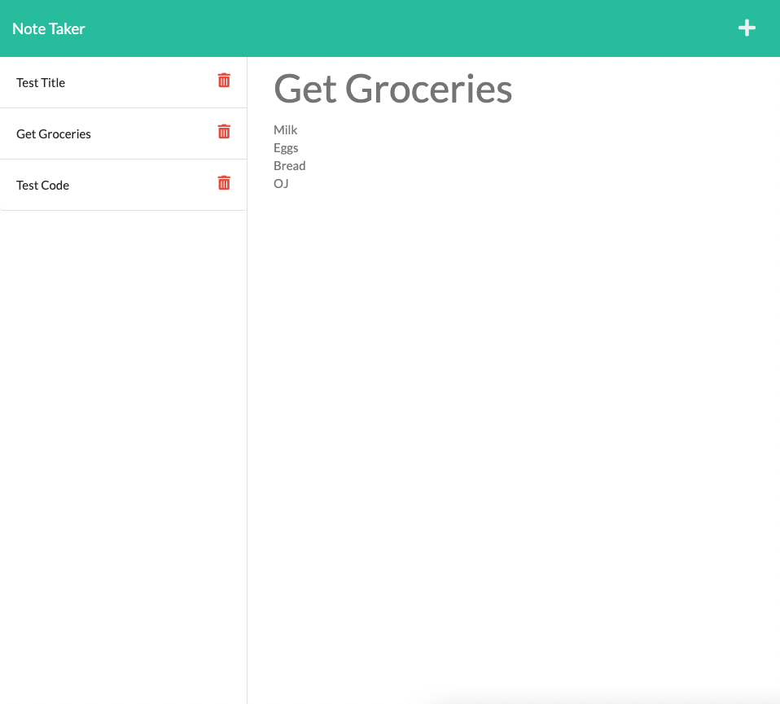

# Note Taker

## Description

A simple app for taking notes using `node` and `express.js`.

## Table of Contents

1. [Usage](#Usage)

2. [Questions](#Questions)

3. [License](#License)

## Usage

Type in a title and text for a note and click the 'save' icon that appears. Click on an existing note to view its contents. Click the 'delete' icon next to a note to remove it from the list.

Deployed app: [Note Taker](https://highdynamics-note-taker.herokuapp.com/)

## Questions

GitHub profile: [HighDynamics](https://github.com/HighDynamics)  
Reach out with additional questions at <HighDynamics@gmail.com>

## License

Licensed under [MIT](https://opensource.org/licenses/MIT).
